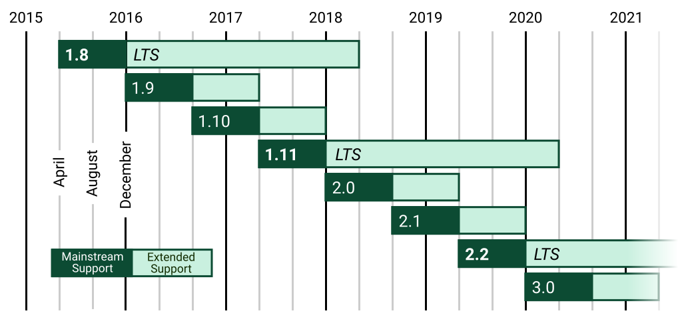

# django第一天

## 1.django简介

​       Django发布于2005年，是当前Python世界里最负盛名且成熟的网络框架。最初用来制作在线新闻的Web站点。Django是一个用Python编写的开放源代码的Web应用框架（源代码是开源的，遵守BSD版权）。采用了MVC的框架模式，也有很多人把它称为MVT（MTV）模式。


### django版本



django各个版本对python的要求：

| Django version | Python versions |
| -------------- | --------------- |
|1.11 | 2.7, 3.4, 3.5, 3.6 |
|2.0|3.4, 3.5, 3.6, 3.7|
|2.1, 2.2|3.5, 3.6, 3.7|

## 2.django的安装

### 2.1.环境要求

​	操作系统：ubuntu16.04

​	python版本：>=3.4

​	Django版本：1.11

### 2.2.安装

首先使用pyenv建立一个虚拟开发环境，然后使用pip安装

```
pyenv virtualenv 3.6.4  blogproject
pyenv activate blogproject
pip install django==1.11.16  #安装指定版本的django
```

安装完毕后，测试一下是否安装成功

~~~
#在虚拟开发环境中
>>>python   #开启python
>>>import django
>>>django.get_version()
~~~

## 3.第一个django项目

先切换到指定目录，开启虚拟环境，然后用以下指令创建一个项目

### 3.1 创建项目

~~~
cd project
pyenv acivate django
django-admin startproject hello
~~~

### 3.2 项目的目录结构：

~~~
├── hello            #项目目录
│   ├── __init__.py  #包标志
│   ├── settings.py  #项目配置文件
│   ├── urls.py      #路由映射表
│   └── wsgi.py      #wsgi接口
└── manage.py        #项目管理命令
~~~

manage.py:是Django用于管理本项目的命令行工具，之后进行站点运行，数据库自动生成等都是通过本文件完成。

***项目配置文件***

~~~
# 项目根目录 manage.py所在目录
BASE_DIR = os.path.dirname(os.path.dirname(os.path.abspath(__file__)))

# 调试模式
DEBUG = True

#允许访问的主机
ALLOWED_HOSTS = ['*']


# 安装的应用，自己定义应用也应该添加到这里
INSTALLED_APPS = [
    'django.contrib.admin',
    'django.contrib.auth',
    'django.contrib.contenttypes',
    'django.contrib.sessions',
    'django.contrib.messages',
    'django.contrib.staticfiles',
]

#模板配置
TEMPLATES = [
    {
        'BACKEND': 'django.template.backends.django.DjangoTemplates',
        'DIRS': [],   #模板路径
        'APP_DIRS': True,
        'OPTIONS': {
            'context_processors': [
                'django.template.context_processors.debug',
                'django.template.context_processors.request',
                'django.contrib.auth.context_processors.auth',
                'django.contrib.messages.context_processors.messages',
            ],
        },
    },
]

# 数据库配置
# https://docs.djangoproject.com/en/1.11/ref/settings/#databases
DATABASES = {
    'default': {
        'ENGINE': 'django.db.backends.sqlite3',
        'NAME': os.path.join(BASE_DIR, 'db.sqlite3'),
    }
}

# 国际化
# https://docs.djangoproject.com/en/1.11/topics/i18n/
LANGUAGE_CODE = 'zh-hans'   #语言编码
TIME_ZONE = 'Asia/Shanghai' #时区
~~~


### 3.3 测试服务器启动

在命令行下键入：

~~~
#命令：python manage.py runserver [ip:port]
python manage.py runserver
python manage.py runserver 0.0.0.0 9000
~~~

测试服务器默认端口是8000，仅限于本地连接。打开浏览器输入：

~~~
http://localhost:8000 #或者
http://127.0.0.1:800
~~~

可以看到自己的网站。


如果要让远程客户端连接需要修改配置文件，其中0.0.0.0:9000是可选的，0.0.0.0说明任何ip都可以访问。

~~~
#修改setting.py中的这一行
ALLOWED_HOSTS = ['*']
~~~

### 3.4 建立应用

一个django项目中可以包含多个应用，可以使用以下命令建立应用：

~~~
#命令： python manager.py startapp  应用名称
实例：  python manager.py startapp app
~~~

创建应用后，项目的结构如下：

```
├── App
│   ├── admin.py    站点管理
│   ├── apps.py          应用程序自身信息
│   ├── __init__.py
│   ├── migrations    数据迁移
│   │   └── __init__.py
│   ├── models.py    模型
│   ├── tests.py
│   └── views.py     视图响应函数
├── db.sqlite3      sqlite数据库
├── hellodjango     项目
│   ├── doc.py
│   ├── __init__.py
│   ├── __pycache__
│   │   ├── __init__.cpython-36.pyc
│   │   ├── settings.cpython-36.pyc
│   │   ├── urls.cpython-36.pyc
│   │   └── wsgi.cpython-36.pyc
│   ├── settings.py    系统配置
│   ├── urls.py         路由映射表
│   └── wsgi.py            wsgi协议
└── manage.py     项目管理命令

```

修改项目的配置文件setting.py:

~~~
INSTALLED_APPS = [
    'django.contrib.admin',
    'django.contrib.auth',
    'django.contrib.contenttypes',
    'django.contrib.sessions',
    'django.contrib.messages',
    'django.contrib.staticfiles',
    'App',     安装自己的应用
]

~~~

到此为止，我们已经搭建好项目的基本框架，但项目还没有实质性内容，下面将从视图函数开始给项目添加功能。

## 4.简单视图函数

在django中view代表视图函数，接收用户的请求，进行处理然后返回html源代码给客户端。在框架中，我们可以在应用（app）的views.py中写自己的视图函数，进行相应的处理。

视图函数只是一个普通的python函数，它的第一个参数必须是一个请求（request）对象，这是框架传入的，我们可以通过请求对象获取提交参数等内容。它的返回值必须是一个web响应，可以文本、html源代码、重定向、404等内容。下面我们写一个简单视图函数，返回“Hello Django"

~~~
from django.http import HttpResponse
def index(request):
	return HttpResponse("Hello Django")
~~~

其中HttpResponse函数需要引入模块django.http，我们可以直接写HttpResponse，然后通过快捷键**alt+enter**，在下拉框中选择要导入的模块。

- alt+enter 代码飘红、飘黄、查看定义、引入包都可以使用。

## 5.基本路由

添加完视图函数后，还无法在浏览器中查看，必须添加路由。所谓**路由**就是将用户请求转换为访问对应的视图函数。项目路由在hello下urls.py中

~~~
"""
from django.conf.urls import url
from django.contrib import admin
from App  import views
urlpatterns = [
    url(r'^admin/', admin.site.urls),
    url(r'^$', views.index)
]

~~~

路由由两部分组成，第一部是一个正则表达式，匹配用户的url，第二部分是视图函数

~~~
 url(r'^$', views.index)
 r'^$' 正则规则匹配请求路径（端口后到？前部分）
 views.index   视图函数
~~~

正则表达式r'^$'匹配用户在地址栏中键入的url，当用户在地址栏中键入http://localhost:9000时会显示Hello World.

## 6.简单模板

在上面我们已经能够展示简单的web页面，但要显示一个html页面，需要使用模板，在app下建立templates目录，在templates目录下建立一个index.html文件

    <!DOCTYPE html>
    <html lang="en">
    <head>
        <meta charset="UTF-8">
        <title>搜狐</title>
    </head>
    <body>
    当你的才华还撑不起你的野心的时候，你就应该静下心来学习；<br>
    当你的能力还驾驭不了你的目标时，就应该沉下心来，历练；
    </body>
    </html>

然后修改views中视图函数index

    from django.shortcuts import render
    def index(request):
        return render(request,'index.html')

重新访问网站。

也可以在html中使用变量和流程控制结构，生成复杂的html

    <!DOCTYPE html>
    <html lang="en">
    <head>
        <meta charset="UTF-8">
        <!--  模板中添加变量   -->
        <title>{{ title }}</title>
    </head>
    <body>
    当你的才华还撑不起你的野心的时候，你就应该静下心来学习；<br>
    当你的能力还驾驭不了你的目标时，就应该沉下心来，历练；
    </body>
    </html>

然后修改视图函数：

    from django.shortcuts import render
    def index(request):
        return render(request,'index.html',content={'title':'草榴'})

重新访问首页


## 7.简单模型

django自带了一个sqlite数据库，可以用于测试，生产环境一般不用。在配置文件中已经设置好默认的sqlite数据库。

    DATABASES = {
        'default': {
            'ENGINE': 'django.db.backends.sqlite3',        #数据库引擎
            'NAME': os.path.join(BASE_DIR, 'db.sqlite3'),  #数据库文件路径
        }
    }

在pycharm左边栏中选----database，然后点选"+",弹出sqlite的配置窗口


将File改为项目中sqlite文件：db.sqlite3，然后点击测试，看看能否连接成功。第一次配置时，需要下载sqlite的驱动。完成后点击ok。

然后到app中models.py中创建一个User类：

    class User(models.Model):
        uname = models.CharField(max_length=20)
        password = models.CharField(max_length=32)

到命令行下，输入：

    python manage.py makemigrations   #生成数据库迁移文件
    python manage.py migrate      #生成数据库表

然后到pycharm左边栏database中查看：


双击app_user添加数据：


到此为止，我们已经给app_user表添加了数据。然后给app添加一个模板：list.html

    <!DOCTYPE html>
    <html lang="en">
    <head>
        <meta charset="UTF-8">
        <title>用户列表</title>
    </head>
    <body>
    <table width="80%" align="center" border="1" cellspacing="0">
        <caption>用户列表</caption>
        
            <tr>
                <td>{{ user.uname }}</td>
                <td>{{ user.password }}</td>
            </tr>
        
    </table>
    </body>
    </html>

继续给app添加一个视图操作函数：

    from app.models import User
    def userlist(req):
        #获取app_user表中所有数据
        persons =  User.objects.all()
        return render(req,"list.html", context={'users':persons})

在项目的路由表中添加路由：

    urlpatterns = [
        url(r'^admin/', admin.site.urls),
        url(r'^$',views.index),
        url(r'^list/$',views.userlist),
    ]

到浏览器中访问：http://localhost:9000/list/