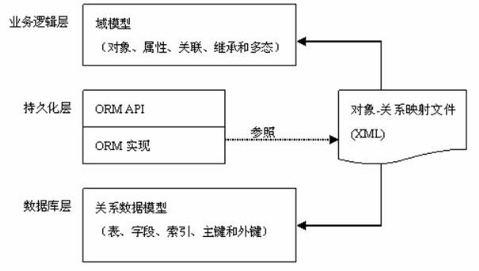
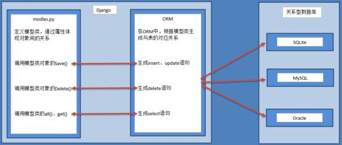

# 二.模型

模型使用步骤：

1. 配置数据库
2. models.py定义模型类
3. 激活模型
4. 使用模型

------

Django默认使用的是sqlite，但在生产环境中一般会用mysql、postgrsql、oracle等关系型数据库。

## 1.数据库配置

在项目的 settings.py 文件中找到 DATABASES 配置项，将其信息修改为：

~~~
DATABASES = {
    'default': {
        'ENGINE': 'django.db.backends.mysql',  #mysql数据库引擎
        'NAME': 'test',                        #数据库名
        'HOST':'localhost',                    #数据库服务器地址
        'USER': 'test',                        #mysql数据库用户名
        'PASSWORD': 'test123',                 #密码
        'PORT':3306,                         #端口号，可选
    }
}
~~~

在虚拟开发环境中，安装mysql的数据库驱动pymysql

~~~
(django) python@ubuntu:~/project/hello$ pip install pymysql
~~~

Django默认使用MySQLdb模块链接MySQL，但python3中还无此模块，所以需要使用pymysql来代替，在项目的`__init__.py`中写入：

~~~
import pymysql
pymysql.install_as_MySQLdb()
~~~

## 2.ORM

对象关系映射（Oject Relational Mapping，简称ORM）模式是一种为了解决面向对象与关系数据库存在的互不匹配的现象的技术。简单的说，ORM是通过使用描述对象和数据库之间映射的元数据，自动生成sql语句，将程序中的对象自动保存到关系数据库中。优点：

- 隐藏了数据库访问的细节，简化了sql的使用，提高了开发效率
- 解耦业务逻辑层（view）和数据处理层（model)，简化了开发流程，提高了系统的可移植性
- 提高了安全性

缺点：

- 执行效率低
- 对复杂sql无能为力
- 增加了学习成本

### 2.1 基本概念

| 面向对象概念 | 面向关系概念     |
| ------------ | ---------------- |
| 类           | 表               |
| 对象         | 记录（一行）     |
| 属性         | 字段（属性、列） |

- 一个模型类对应一个表
- 每个模型类都必须继承django.db.models.Model

### 2.2 模型属性

模型中的属性和数据库表的字段对应，必须定义。模型的属性需要定义成类属性

~~~
#属性定义语法为：
属性 = models.字段类型(选项)
~~~

- 属性命名规则：
  - 不能是python的保留关键字
  - 不允许使用连续的下划线，因为连续下划线在查询中会用到
  - 定义属性时需要指定字段类型
  - 主键一般不用自己定义，django会自动创建自增长主键列，如果你自己定义了主键，则django不会再自动生成主键

#### 2.2.1字段类型

| 字段名称         | 字段说明                                                     | 参数                                                  |
| ---------------- | ------------------------------------------------------------ | ----------------------------------------------------- |
| AutoField        | 一个根据实际Id自动增长的 IntegerField（通常不指定 自动生成） |                                                       |
| CharField        | 字符串，默认的表单样式是 TextInput                           | max_length=字符长度                                   |
| TextField        | 大文本字段，一般超过4000使用，默认的表单控件是Textarea       |                                                       |
| IntegerField     | 整数                                                         |                                                       |
| DecimalField     | 使用python的Decimal实例表示的十进制浮点数                    | max_digits总位数；decimal_places小数位数              |
| FloatField       | 用Python的float实例来表示的浮点数                            |                                                       |
| BooleanField     | true/false 字段，此字段的默认表单控制是CheckboxInput         |                                                       |
| NullBooleanField | 支持null、true、false三种值                                  |                                                       |
| DateField        | 使用Python的datetime.date实例表示的日期，该字段默认对应的表单控件是一个TextInput | auto_now和auto_now_add、default这三个参数不能同时共存 |
| TimeField        | 使用Python的datetime.time实例表示的时间                      | 参数同DateField                                       |
| DateTimeField    | 使用Python的datetime.datetime实例表示的日期和时间            | 参数同DateField                                       |
| ImageField       | 继承了FileField的所有属性和方法，但对上传的对象进行校验，确保它是个有效的image |                                                       |

- auto_now: 每次保存对象时，自动设置该字段为当前时间，用于"最后一次修改"的时间戳，它总是使用当前日期，默认为false
- auto_now_add: 当对象第一次被创建时自动设置当前时间，用于创建的时间戳，它总是使用当前日期，默认为false

#### 2.2.2 字段选项

适用于任何字段，可以实现字段的约束，在生成字段时通过方法的关键字参数指定。

| 可选参数    | 说明                                                         |
| ----------- | ------------------------------------------------------------ |
| null        | 如果`True`，Django将`NULL`在数据库中存储空值。默认是`False`。不要在字符串字段上使用。null是数据库范畴的概念 |
| blank       | 如果`True`，该字段允许为空。默认是`False`。同null不同， 如果字段有`blank=True`，则表单验证将允许输入空值。如果字段有`blank=False`，则需要该字段。 |
| db_column   | 用于此字段的数据库列的名称。如果没有给出，Django将使用该字段的名称。 |
| db_index    | 如果`True`，将为此字段创建数据库常规索引。                   |
| unique      | 如果`True`，该字段在整个表格中必须是唯一的。                 |
| primary_key | 如果`True`，此字段是模型的主键。                             |
| default     | 默认值  当前字段如果不给值则执行默认值                       |

## 3.定义模型

我们可以在应用的models.py中定义模型：

~~~
from django.db import models

class 模型名(models.Model):
    属性名 = models.字段名(字段选项/参数)
    .....
    class Meta:   #可选，任何非字段的设置可以写到Meta中
        db_table = 'user'   #指定表名为uesr
~~~

- 数据库的表名等于：应用名_模型名，如果想指定表名，可以在Meta中使用db_table指定

- 如果没有指定主键，Django将自动给表创建一个自增长主键id

  ~~~
  id = models.AutoField(primary_key=True)
  ~~~

下面我们定义几个模型类

~~~
from django.db import models
from django.utils import timezone

#用户类
class User(models.Model):
    uid = models.AutoField(primary_key=True)  #自增主键
    uname = models.CharField(max_length=60)
    password = models.CharField(max_length=32)
    user_type = ((1,'超级管理员'),(2,'普通用户'))  #用户自定义类型对应mysql的enum类型
    type = models.IntegerField(default=2,choices=user_type)
    regtime = models.DateTimeField(default=timezone.now)  #缺省值是当前时间
    ip = models.IntegerField(null=True)
    login_type = ((1,'允许登录'),(2,'禁止登录'))   #用户自定义类型对应mysql的enum类型
    allowed = models.IntegerField(default=1,choices=login_type)
    email = models.CharField(max_length=100,null=True)
    memo = models.CharField(max_length=1000,null=True)

    class Meta:
        db_table = 'user'   #表名
~~~

## 4.激活模型

- 创建迁移文件 （此刻表并没有创建到库中）

  ~~~
  $ python3 manage.py makemigrations
  ~~~

- 执行迁移 （将模型创建到库中）

  ~~~
  $ python3 manage.py migrate
  ~~~

然后在应用的migrations目录中应该生成了迁移文件

~~~
├── app
│   ├── admin.py
│   ├── apps.py
│   ├── __init__.py
│   ├── migrations
│   │   ├── 0001_initial.py
│   │   ├── __init__.py
~~~

生成的表结构如下：

~~~
CREATE TABLE `user` (
  `uid` int(11) NOT NULL AUTO_INCREMENT,
  `uname` varchar(60) NOT NULL,
  `password` char(32) NOT NULL,
  `type` enum('超级管理员','普通用户') DEFAULT '普通用户',
  `regtime` datetime DEFAULT NULL,
  `ip` int(11) DEFAULT NULL,
  `allowed` enum('允许登录','禁止登录') DEFAULT '允许登录',
  `email` varchar(100) DEFAULT NULL,
  `memo` varchar(1000) DEFAULT NULL,
  PRIMARY KEY (`uid`)
) 
~~~

**注意：**

- 任何对字段或表的修改都需要重新迁移

## 5.模型的使用

我们可以再交互式Python shel环境中，使用Django提供的免费API。要调用Python shell，请使用以下命令：

~~~
$ python manage.py shell
Python 3.6.4 (default, Sep 13 2018, 02:27:17) 
[GCC 5.4.0 20160609] on linux
Type "help", "copyright", "credits" or "license" for more information.
(InteractiveConsole)
>>> 
~~~

### 5.1 增删改

~~~
>>> from app.models.User import User   #导入User模型
>>> from  hashlib import md5
>>> user = User(uname='admin',password=md5(b'123').hexdigest())  #实例化一个新对象
>>> user.save()   #insert 插入数据库
>>> user.uid      #显示uid的值
 4
#在mysql中查询新插入的记录
mysql> select uid,uname,password,type,allowed from user;
+-----+--------------+----------------------------------+--------------+--------------+
| uid | uname        | password                         | type         | allowed      |
+-----+--------------+----------------------------------+--------------+--------------+
|   1 | dddddksdf    | bc9858af5f37d3cf147a3923c8b9a3d9 | 普通用户     | 允许登录     |
|   2 | tom123       | 59f2443a4317918ce29ad28a14e1bdb7 | 普通用户     | 允许登录     |
|   3 | 隔壁老王     | 1e9ce4a8f8c6b2baa00b1783de4b0ef0 | 普通用户     | 允许登录     |
|   4 | admin        | 202cb962ac59075b964b07152d234b70 | 普通用户     | 允许登录     |
+-----+--------------+----------------------------------+--------------+--------------+
4 rows in set (0.00 sec)

>>> u1 = User.objects.get(pk=1)  #获取uid=1的记录
>>> u1.uid
1
>>> u1.delete()       #删除该记录
(1, {'app.Comment': 0, 'app.User': 1})

#查询mysql
mysql> select uid,uname,password,type,allowed from user;
+-----+--------------+----------------------------------+--------------+--------------+
| uid | uname        | password                         | type         | allowed      |
+-----+--------------+----------------------------------+--------------+--------------+
|   2 | tom123       | 59f2443a4317918ce29ad28a14e1bdb7 | 普通用户     | 允许登录     |
|   3 | 隔壁老王      | 1e9ce4a8f8c6b2baa00b1783de4b0ef0 | 普通用户     | 允许登录     |
|   4 | admin        | 202cb962ac59075b964b07152d234b70 | 普通用户     | 允许登录     |
+-----+--------------+----------------------------------+--------------+--------------+
3 rows in set (0.00 sec)

# 修改单条记录
>>> u2 = User.objects.get(pk=2)
>>> u2.uname = '小甜甜'     #update  更新
>>> u2.save()

# 修改多条记录
>>> users = User.objects.all()
>>> users.update(password=md5(b'345').hexdigest())

#查询mysql
mysql> select uid,uname,password,type,allowed from user;
+-----+--------------+----------------------------------+--------------+--------------+
| uid | uname        | password                         | type         | allowed      |
+-----+--------------+----------------------------------+--------------+--------------+
|   2 | 小甜甜       | 59f2443a4317918ce29ad28a14e1bdb7 | 普通用户     | 允许登录     |
|   3 | 隔壁老王     | 1e9ce4a8f8c6b2baa00b1783de4b0ef0 | 普通用户     | 允许登录     |
|   4 | admin        | 202cb962ac59075b964b07152d234b70 | 普通用户     | 允许登录     |
+-----+--------------+----------------------------------+--------------+--------------+
3 rows in set (0.00 sec)
~~~

- 数据的逻辑删除

  对于重要数据，一般不会直接删除，会在表中增加一个字段比如：is_deleted，如果删除的话，将这个字段置为True，以后查询的时候不在查询，这种操作称为**逻辑删除**

### 5.2 数据查询

要从数据库检索数据，首先要获取一个***查询集***(QuerySet)，查询集表示从数据库获取的对象集合，它可以有零个，一个或多个*过滤器*。返回查询集的方法，称为过滤器，过滤器根据给定的参数缩小查询结果范围，相当于sql语句中where或limit。

- 在管理器上调用过滤器方法会返回查询集
- 查询集经过过滤器筛选后返回新的查询集，因此可以写成**链式过滤**
- **惰性执行**：创建查询集不会带来任何数据库的访问，直到调用数据时，才会访问数据库
- 以下对查询集求值：迭代、切片、序列化、与if合用、repr()/print()/len()/list()/bool()

| &nbsp;            管理器的方法 | 返回类型 | 说明                                                         |
| ------------------------------ | -------- | ------------------------------------------------------------ |
| 模型类.objects.all()           | QuerySet | 返回表中所有数据                                             |
| 模型类.objects.filter()        | QuerySet | 返回符合条件的数据                                           |
| 模型类.objects.exclude()       | QuerySet | 返回不符合条件的数据                                         |
| 模型类.objects.order_by()      | QuerySet | 对查询结果集进行排序                                         |
| 模型类.objects.values()        | QuerySet | 返回一个列表  每个元素为一个字典                             |
| 模型类.objects.reverse()       | QuerySet | 对排序的结果反转                                             |
| 模型类.objects.get()           | 模型对象 | 返回一个满足条件的对象； 如果没有找到符合条件的对象，会引发模型类.DoesNotExist异常;  如果找到多个，会引发模型类.MultiObjectsReturned 异常 |
| 模型类.objects.count()         | int      | 返回查询集中对象的数目                                       |
| 模型类.objects.first()         | 模型对象 | 返回第一条数据                                               |
| 模型类.objects.last()          | 模型对象 | 返回最后一条数据                                             |
| 模型类.objects.exists()        | bool     | 判断查询的数据是否存在                                       |

#### 5.2.1 返回查询集

- all()

  ~~~
  # 获取所有数据，对应SQL：select * from User
  User.objects.all()
  ~~~

- filter(**kwargs) 返回QuerySet包含与给定查找参数匹配的新查询集。

  ~~~
  #等价sql：select * from User
  User.objects.filter()

  #等价sql：select * from User where uname = 'admin'
  User.objects.filter(uname='admin')

  #等级sql：select * from User where uid > 1 and type = 2
  User.objects.filter(uid__gt=1,type=2)

  #链式调用，等价于User.objects.filter(uid__gt=1,type=2)
  User.objects.filter(uid__gt=1).filter(type=2)
  ~~~

- exclude(**kwargs)

  ~~~
  # 不匹配，对应SQL：select * from User where name != 'admin'
  User.objects.exclude(name='admin')
  ~~~

- order_by(*fields)

  - 参数是字段名，可以有多个字段名，默认是升序。

  - 如果要按某个字段降序，在字段名前加'-'： "-uid"表示按uid降序排列

  ~~~
  #按uid升序排列  等价于 order by uid
  User.objects().order_by('uid')

  #按uid降序排列  等价于 order by uid desc
  User.objects.order_by('-uid')

  #多列排序 等价于 order by password,uid desc
  User.objects.order_by('password','-uid')
  ~~~

- values()

  ~~~
  #返回所有字段
  User.objects.values()
  #返回数据：
  [{'uid': 2, 'uname': '小甜甜', 'password': '59f2443a4317918ce29ad28a14e1bdb7'type': '普通用户', 'regtime': None, 'ip': None, 'allowed': '允许登录', 'email': None, None},...]
   
  #返回指定字段
  User.objects.values('uname','password')
  [{'uname': '小甜甜', 'password': '59f2443a4317918ce29ad28a14e1bdb7'},...]
  ~~~

- reverse()

  ~~~
  User.objects.order_by('id').reverse()  降序
  User.objects.order_by('-id').reverse()  升序
  ~~~

- distinct() 去重

  ~~~
  User.objects.values('password').distinct()
  ~~~

  ​

#### 5.2.2  返回单个值

下面这些方法后面不能再跟其他过滤方法，因为他们不返回查询集

- get() 只匹配一条数据

  ~~~
  u = User.objects.get(pk=1)  #正常
  u = User.objects.get(uid__gt=20) #MultipleObjectsReturned 匹配到了多条数据
  u = User.objects.get(uid__lt=-1) #DoesNotExist 匹配失败
  ~~~

- first()和last()

  ~~~
  User.objects.all().first()  #返回结果集中第一条数据
  User.objects.all().last()   #返回结果集中最后一条数据
  ~~~

- count() 

  - 返回结果集记录数目，等价于select count(*)
  - 不会返回整个结果集，相比len方法更有效

  ~~~
  User.objects.count()
  ~~~

- exists()

  - 判断查询集中是否有记录，有返回True，否则返回False

    ~~~
    User.objects.filter(uid=3).exists()
    ~~~

#### 5.2.3查询集限制

查询集类似列表，可以使用下标进行限制，类似sql语句中的limit子句。但索引不能是负数

- 索引
- 切片

~~~
User.objects.all()[0]  #等同于：limit 0,1
User.objects.all()[2]  #等同于：limit 2,1
User.objects.all()[0:2] #等同于limit 2
User.objects.all()[:2] #等同于limit 2
User.objects.all()[::2] 
~~~

#### 5.2.4 字段查询

相当于sql语句中where子句，它可以为filter、exclude和get方法提供参数。

~~~
属性名称__比较运算符=值   #是两个下划线
~~~

| 操作符      | 说明                       | 示例                                                         |
| ----------- | -------------------------- | ------------------------------------------------------------ |
| exact/=     | 精确判等                   | uname = 'admin'   `uname__exact = 'admin'` `uname__exact = None`  #uname is null |
| iexact      | 不区分大小写判等           | name__iexact = 'admin'                                       |
| contains    | 模糊查询，等价like '%值%'  | uname__contains = 'admin'                                    |
| icontains   | 不区分大小写的模糊查询     | uname__icontains = 'Admin'                                   |
| startswith  | 以..开头                   | uname__startswith = 'a'                                      |
| istartswith | （不区分大小写)以...开头   | uname__istartswith = 'a'                                     |
| endswith    | 以...结尾                  | uname__endswith = 'm'                                        |
| iendswith   | （不区分大小写)以...结尾   | uname__iendswith = 'm'                                       |
| isnull      | 判空(等价 = None)          | `uname__isnull = True` #等价 uname is null `unam__isnull` = False #等价 uname is not null |
| in          | 包含                       | uid__in = [1,2,3] #in后面必须是可迭代对象                    |
| range       | 范围测试（相当between and) | `uid__range = [2,5]` #uid >=2 and uid <=5                    |
| gt/gte      | 大于/大于等于              | `uid__gt = 2`                                                |
| lt/lte      | 小于/小于等于              | uid__lte = 2                                                 |
| regex       | 正则匹配                   | uname__regex= r'^a'                                          |
| iregex      | 不区分大小写的正则匹配     | uname__iregex= r'^a'                                         |

- in后面可以跟一个子查询，但要求子查询只能返回一个字段

  ~~~
  User.objects.filter(uid__in = (2,3,4))
  User.objects.filter(uid__in = [2,3,4])
  res = User.objects.filter(uid__gt = 1).values('uid')  #查询集中只有一个字段uid
  User.objects.filter(uid__in = res
  ~~~

- 日期查询

  - year、month、day、week_day、hour、minute、second

  ~~~
   #等价sql: select * from User where year(regtime) = 2018
   User.objects.filter(regtime__year = 2018) 
  ~~~

#### 5.2.5 统计查询

需要先导入模块：

~~~
from django.db.models import Max,Min,Sum,Avg,Count
~~~

- 聚合查询：对多行查询结果的一列进行操作

~~~
#统计记录总数： select count(*) from user
User.objects.aggregate(Count('uid'))    #{'uid__count': 4}
User.objects.aggregate(Max('uid'))      #{'uid__max': 5}
User.objects.aggregate(Min('uid'))      #{'uid__min': 2}
~~~

- 分组统计

~~~
#等价sql: select type,count(*) from user group by type
res = User.objects.values('type').annotate(Count('uid'))
#统计结果： [{'type': '普通用户', 'uid__count': 3}, {'type': '超级管理员', 'uid__count': 1}]

#查看生成的sql语句
print(res.query)
#SELECT `user`.`type`, COUNT(`user`.`uid`) AS `uid__count` FROM `user` GROUP BY `user`.`type` ORDER BY NULL
~~~

#### 5.2.6 Q对象和F对象

需要先导入模块：

~~~
from django.db.models import Q,F
~~~

- Q对象可以对关键字参数进行封装，从而更好的应用多个查询，可以组合&(and)、|(or)、~(not)操作符。

~~~
#原生sql:select * from user where uid = 2 or uid = 3
User.objects.filter(Q(uid=2)|Q(uid=3))
User.objects.filter(Q(uid__gte=2) & Q(uid__lte=3))
User.objects.filter(~Q(uid__gte=2))
~~~

- F对象：用于比较表中两个字段

~~~
#等价sql：select * from user where uid < type
User.objects.filter(uid__lte = F('type'))
~~~

## 6.模型成员

​    模型类和数据库中表对应，模型类的对象和记录对象，模型类本身没有数据库访问功能，但模型类中有一个Manager类的对象，通过管理器对象可以实现和数据库的访问。

​       当我们没有为模型类定义管理器时，Django会为模型类生成一个名为objects的管理器，自定义管理器后，Django不再生成默认管理器objects。

​       管理器是Django的模型进行数据库操作的接口，Django应用的每个模型都拥有至少一个管理器。Django支持自定义管理器类，继承自models.Manager。

自定义管理器类主要用于两种情况：

- 修改原始查询集
- 向管理器类中添加额外的方法，如向数据库中插入数据。

### 6.1 重命名管理器

在模型类中自定义一个新的管理器，则原有的objects管理器不会存在，以后对数据库的操作使用自己定义的管理器

~~~
#模型类
class Artical(models.Model):
    aid = models.AutoField(primary_key=True)
    title = models.CharField(max_length=100,null=False)
    content = models.TextField(max_length=10000,null=True)
    ....
    art_manager = models.Manager()  #自定义了一个新的管理器，名字为art_manager
    
#views
def article_get(request):
    articles = Artical.art_manager.all()   #使用art_manager进行查询
    return render(request,"articlelist.html",context={'articls':articles})
~~~

### 6.2 自定义管理器

- 修改原始查询集（由all()获取的查询集）

  - 修改管理器的get_queryset方法，可以改变all方法返回的原始查询集

  ~~~
  #首先自定义Manager的子类
  class ArticleManager(models.Manager):
      def get_queryset(self):
          return super().get_queryset().filter(ispublished=True)  #获取已发表的文章
  #模型类
  class Artical(models.Model):
     ....
      objects = models.Manager()  #可以有多个管理器
      publishManager = ArticleManager()
      
  #views
  def article_publish(request):
      published = Artical.publishManager.all()
      return HttpResponse("已经发表{}".format(published[0].title))
  ~~~

- 给管理器类中添加额外的方法

  ~~~
  class ArticleManager(models.Manager):
      def get_queryset(self):
          return super().get_queryset().filter(ispublished=True)
      #新增一个创建对象的方法
      def create(self,title,content,publishingdate,comments,likenum,ispublished):
          article = Artical()
          article.title = title
          article.content = content
          article.publishingdate = publishingdate
          article.comments = comments
          article.likenum = likenum
          article.ispublished = ispublished
          article.save()
          return article
  #views.py中
  def article_add(request):
       # art = Artical(title='小时代',content="混乱的逻辑")
       # art.save()
       Artical.publishManager.create('中美贸易战','川朴一豆比','2018-10-8',0,0,1)
       return HttpResponse("保存成功")
  ~~~

  ​

修改mysql的字符集

- 显示mysql的字符集： show variables like 'character%'；

~~~
+--------------------------+----------------------------+
| Variable_name            | Value                      |
+--------------------------+----------------------------+
| character_set_client     | utf8                       |
| character_set_connection | utf8                       |
| character_set_database   | utf8                       |
| character_set_filesystem | binary                     |
| character_set_results    | utf8                       |
| character_set_server     | utf8                       | 服务器字符集
| character_set_system     | utf8                       |
| character_sets_dir       | /usr/share/mysql/charsets/ |
+--------------------------+----------------------------+
8 rows in set (0.08 sec)

~~~

python@ubuntu:~$ cd /etc/mysql/
python@ubuntu:/etc/mysql$ ls
conf.d        fabric.cfg       mysql.cnf
debian.cnf    my.cnf           mysql.conf.d
debian-start  my.cnf.fallback  mysql-fabric-doctrine-1.4.0.zip
python@ubuntu:/etc/mysql$ cd mysql.conf.d/
python@ubuntu:/etc/mysql/mysql.conf.d$ ls
mysqld.cnf  mysqld.cnf.bak  mysqld_safe_syslog.cnf
python@ubuntu:/etc/mysql/mysql.conf.d$ sudo cp mysqld.cnf mysqld.cnf.bak1
python@ubuntu:/etc/mysql/mysql.conf.d$ ls
mysqld.cnf  mysqld.cnf.bak  mysqld.cnf.bak1  mysqld_safe_syslog.cnf

python@ubuntu:/etc/mysql/mysql.conf.d$ sudo vim mysqld.cnf

~~~
在[mysqld]下增加
character_set_server = utf8
保存退出
~~~

python@ubuntu:/etc/mysql/mysql.conf.d$ sudo service mysql restart     #重启服务