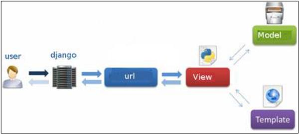
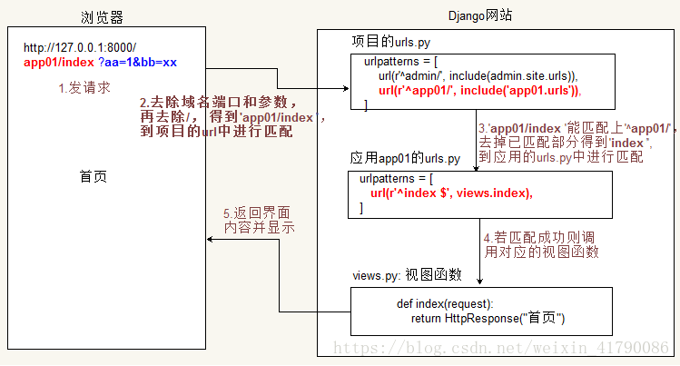

# 视图

Django中的视图主要用来接受Web请求，并做出响应。此响应可以是网页，重定向或404错误，XML文档或图像等的HTML内容。在mvt模式中，视图负责从模型中获取数据，然后展示在模板中，是联系模型和模板的桥梁，是业务逻辑层。

视图的相应过程：

当用户从浏览器发起一次请求时，首先django获取用户的请求，然后通过路由（urls）将请求分配到指定的是视图函数。视图函数负责进行相应的业务处理，处理完毕后把结果（可能是json、html等）浏览器

## 1.路由

当用户在您的Web应用程序上发出页面请求时，Django会获取url中请求路径（端口之后的部分），然后通过urls.py文件查找与路径相匹配的视图，然后返回HTML响应或404未找到的错误（如果未找到）。在urls.py中，最重要的是 “urlpatterns” 元组。这是您定义URL和视图之间映射的地方。映射是URL模式中的元组，例如

~~~
from django.conf.urls import patterns, include
from app import views

urlpatterns = patterns('',
   url(r'^hello/$', views.hello, name='hello'),
   url(r'^blog/', include('blog.urls')),
)
~~~

**映射由三个元素组成 **

- 模式 - 匹配您想要解析的URL和地图的正则表达式。 所有可以与python的're'模块一起工作的模式都适用于模式（当你想通过url传递参数时很有用）。
- 视图的Python路径 - 与导入模块时相同。
- 名称 - 为了执行URL反转，您需要使用上述示例中的命名URL模式。 完成后，只需启动服务器即可通过以下网址访问您的视图：http：//127.0.0.1/hello

### 1.1 模式

模式包含了一个上尖括号(^)和一个美元符号($)。这些都是正则符号，上尖括号表示从字符串开头匹配。美元符号表示匹配字符串的结尾，这两个符号和到一起就表示模式必须完全匹配路径，而不是包含一部分。比如对于模式：

`r'^hello/$' `如果不包含美元符，也就是`r'^hello/' `，任何以/hello/的url都可以匹配，例如：/hello/world/、/hello/1/2/等，同样如果不以上尖括号开头，则任何以hello/做结尾的url都可以匹配。

Django检查url模式之前会移除模式前的/，所以url模式前面的/可以不写，但如果在地址栏里请求的时候不带尾斜杠，则会引起重定向，重定向到带尾斜杠的地址，所以请求的时候要带尾斜杠。

模式匹配的时候要注意：

- Django从上往下进行模式匹配，一旦匹配成功就不会往下继续匹配了
- 一个视图函数可以有多个模式匹配
- 模式前面的/不需要加
- 如果匹配不上，则会引起异常，Django会调用错误处理视图处理（关闭调试模式）

### 1.2 URL配置

在setting中指定根级url配置文件，对应的属性ROOT_URLCONF

(1)urlpatterns：一个url实例的列表，全在根配置中搞定

(2)导入其它url配置:	在应用中创建urls.py文件,编写匹配规则，在工程urls.py中进行导入包含

~~~
from django.conf.urls import include
urlpatterns = [ url(r'^xxx/',include('App.urls')) ]
~~~

Django的请求处理流程：

- Django获取用户发出请求
- Django在工程配置文件settings.py中通过ROOT URLCOF配置来确定根URLconf
- Django在URLconf中的所有URL模式中，查找第一个配的条目。
- 如果找到匹配，将调用相应的视图函数，并将HttpReuest对象传入
- 视图函数回一个HttpResponse响应

### 1.3 动态url

前面写的url都是静态的，无法给视图函数传递数据，要想给视图函数传参数，url必须是动态，带有参数，但Django主张漂亮简介的url，所以不会使用查询字符串（/hello?name=tom），而是采用通配符：

~~~
url(r'^hello/(\w+)/$')   #http://localhost:8000/hello/tom/
~~~

其中（）部分是正则的组， django在进行url匹配时，就会自动把匹配成功的内容，作为参数传递给视图函数。

- 位置参数：url中的正则表达式组，和视图函数中的参数一一对应，函数中的参数名可以随意指定。

~~~
#位置参数：hello/name/age
url(r'^hello/(\w+)/(\d{1,2})/$',views.hello)

#视图函数
def hello(req,value1,value2):  #参数名字随意，但从左往右和url中分组对应
    return HttpResponse("哈喽:" + value1 + " age= {}".format(value2))
~~~

- 关键字参数：对正则表达式分组进行命名

~~~
?P<组名>
url(r'^hello/(?P<name>\w+)/(?P<age>\d{1,2})/$',views.hello),

#视图函数
def hello(req,name,age):  #参数名字必须是name和age，和url中命名一致，但顺序随意
    return HttpResponse("哈喽:" + name + " age= {}".format(age))
~~~

**匹配/分组算法**：

- 在一个匹配模式中要么使用命名分组，要么使用无命名分组，不能同时使用
- 请求的URL被看做是一个普通的Python 字符串， URLconf在其上查找并匹配。进行匹配时将不包括GET或POST请求方式的参数以及域名。换句话讲，对同一个URL的无论是POST请求、GET请求、或HEAD请求方法等等 —— 都将路由到相同的函数。
- 每个捕获的参数都作为一个普通的Python 字符串传递给视图，无论正则表达式使用的是什么匹配方式。

## 2.视图

视图本质上是一个函数（类）。这个函数第一个参数的类型是HttpReuest；它 回一个 HttpResponse实例。为了使一个Python的函数成为一个Django可识别的视图，它必须 足这两个条件。

- 作用：接收并处理请求，调用模型和模板，响应请求（返回HttpResponse或其子类）
  - 响应模板
  - 重定向
  - 直接响应字符串
  - 响应错误模板
  - json数据

### 2.1 HttpRequest

HttpRequest是从web服务器传递过来的请求对象，经过Django框架封装产生的，封装了原始的Http请求

- 服务器接收到http请求后，django框架会自动根据服务器传递的环境变量创建HttpRequest对象
- 视图的第一个参数必须是HttpRequest类型的对象
- 在django.http模块中定义了HttpRequest对象的API
- 使用HttpRequest对象的不同属性值，可以获取请求中多种信息

| 属性         | 说明                                                         |
| ------------ | ------------------------------------------------------------ |
| content-type | 请求的mime类型                                               |
| GET          | 一个类似于字典的QueryDict对象，包含get请求方式的所有参数，也就是“?”后面的内容 |
| POST         | 一个类似于字典的QueryDict对象，包含post请求方式的所有参数    |
| COOKIES      | 一个标准的Python字典，包含所有的cookie，键和值都为字符串     |
| SESSION      | 一个类似于字典的对象，表示当前的会话，只有当Django启用会话的支持时才可用 |
| PATH         | 一个字符串，表示请求的页面的完整路径，不包含域名             |
| method       | 一个字符串，表示请求使用的HTTP方法，常用值包括：GET、POST，  |
| FILES        | 一个类似于字典的QueryDict对象，包含所有的上传文件            |
| META         | 请求的请求头的源信息（请求头中的键值对）                     |
| encoding     | 字符编码                                                     |
| scheme       | 协议                                                         |

下面是常用的方法

| 方法名               | 说明                    |
| -------------------- | ----------------------- |
| get_host()           | 获取主机名+端口         |
| get_full_path()      | 获取请求路径+查询字符串 |
| is_ajax()            | 如果是ajax请求返回True  |
| build_absolute_uri() | 完整的url               |

#### 2.2.1 QueryDict

QueryDict是Dict的子类，和Dict最大的不同是，值都是列表。用于存储从请求中传递过来的参数，例如对于表单中select、checkbox等多值参数，QueryDict非常合适。get、post、files请求都对应一个QueryDict

- HttpRequest中QueryDict是不可变的，只能获取值，不能修改
- QueryDict键值对都是字符串
- QueryDict中一个键可以对应多个值

~~~
#QueryDict
{'hobby':['打篮球','玩游戏','k歌'],'name':['tom'],'age':'21'}
~~~

- 常用操作

~~~
# 1.判断get或post请求中包含指定键
if 'name' in req.GET
    # to do 
    
# 2.获取get或post请求中指定键对应的单一值
  print(req.GET.get('name','无名'))
  print(req.GET['name'])
  #两种方式的区别，如果用下标，键不存在，则包keyerror，get方法则会得到默认值，如果没有默认值则返回None
  
#3 获取指定键对应的多个值(列表)
  print(req.GET.getlist('name'))

#4 获取所有键值对
  for x in req.GET.lists():
  	  print(x)
~~~

### 2.2 HttpResponse

每一个视图函数必须返回一个响应对象，HttResponse对象由程序员创建并返回。

| 属性         | 说明               |
| ------------ | ------------------ |
| content      | 字节字符串         |
| charset      | 字符编码           |
| status_code  | http状态码         |
| content_type | 指定输出的MIME类型 |

#### 2.2.1 不调用模板，直接返回内容

~~~
def hello(req):
	return HttpResponse("hello world")
def goodbye(req):
	res = HttpResponse()
	res.content = b'good bye'
	res.charset = "utf-8"
	res.content_type = 'text/html'
	return res
~~~

#### 2.2.2 调用模板返回

一般用render函数返回，render只是HttpResponse的包装，还是会返回一个HttpResponse对象

def render_to_response(template_name, context=None, content_type=None, status=None, using=None):

   template_name ： 模板名称。 

   context： 一组字典的值添加到模板中。默认情况下，这是一个空的字典。

   content_type ：MIME类型用于生成文档。

   status ：为响应状态代码。默认值为200 

~~~
def studentlist(req):
    for key in req.GET.lists():
        print(key)
    allstudent = Student.objects.all()
    return render(req,'studentlist.html',context={'data':allstudent})
~~~

- 常用方法：
  - write(content) 设置内容 == obj.content
  - set_cookie()  设置cookie
  - delete_cookie()  删除cookie

### 2.3 JsonResponse 

JsonResponse 是HttpResponse的子类，用于向客户端返回json数据。一般用于ajax请求。它的content-type缺省值为：application/json

~~~
from django.http import JsonResponse  #导包
class JsonResponse(data, encoder=DjangoJSONEncoder, safe=True, json_dumps_params=None, **kwargs)
参数：
    data：可以是字典，如果safe设置为False，也可以是json序列化对象
    encoder：编码格式，缺省是django.core.serializers.json.DjangoJSONEncoder
    safe：缺省是True，如果传递非字典给data，则报TypeError
~~~

- 系统模块自带的json和JsonResponse

~~~
from django.http import JsonResponse 
import json as myJson
#返回json数据
def json(req):
    jsonStr = JsonResponse({'name':'zhangsan','age':18})
    jsonStr = myJson.dumps({'name':'zhangsan','age':18})
    return HttpResponse(jsonStr)
~~~

json.dumps给ajax返回数据以后 js代码中需要将json数据使用Json.parse() 进行解析成js对象   而JsonResponse会自动转换为js对象（少了异步Json.parse()的转换）

- QuerySet转Json

~~~
def courselist(req):
    courses = Course.objects.all()   #QuerySet
    data = {'course':list(courses.values())}  #查询结果集QuerySet转字典
    return JsonResponse(data)  #传字典给JsonResponse
# 返回数据格式
{'course': [{'cname': '计算机组成原理', 'cid': 1}, {'cname': '英语', 'cid': 2}, {'cname': '数学', 'cidame': 'c语言程序设计', 'cid': 4}, {'cname': 'python从入门到精通', 'cid': 5}]}

def courselist(req):
    courses = Course.objects.all()
    data = json.dumps(list(courses.values()))  #查询结果集QuerySet转Json字符串，序列化
    return JsonResponse(data,safe=False)  #safe必须设置为False
# 返回的数据格式
[{"cname": "\u8ba1\u7b97\u673a\u7ec4\u6210\u539f\u7406", "cid": 1}, {"cname": "\u82f1\u8bed", "cid": 2}, {"cname": "\u6570\u5b66", "cid": 3}, {"cname": "c\u8bed\u8a00\u7a0b\u5e8f\u8bbe\u8ba1", "cid": 4}, {"cname": "python\u4ece\u5165\u95e8\u5230\u7cbe\u901a", "cid": 5}]

~~~

- 模型转Json

~~~
class Course(models.Model):
    cname = models.CharField(max_length=50)
    cid = models.AutoField(primary_key=True)
	# 给模型添加to_dict方法
    def to_dict(self):
        return dict([(key, self.__dict__[key]) for key in self.__dict__.keys() if key != "_state"])

# 视图函数
def courseshow(req):
    course = Course.objects.get(pk=1)  # 返回的是对象，不是QuerySet
    return JsonResponse(course.to_dict())
~~~

### 2.4 重定向

当浏览器向server发送一个请求，要求获取一个资源时，在server接收到这个请求后发现请求的这个资源实际存放在另一个位置，于是server在返回的response中写入那个请求资源的正确的URL，并设置reponse的状态码为301（表示这是一个要求浏览器重定向的response)，当client接受到这个response后就会根据新的URL重新发起请求。重定向有一个典型的特症，即：当一个请求被重定向以后，最终浏览器上显示的URL往往不再是开始时请求的那个URL了。这就是重定向的由来。

HttpResponseRedirect是HttpResponse的子类，可以完成页面的重定向，当执行完特定动作或出现错误时，我们会希望执行的页面，如果判定用户没有登录则转到登录页面。重定向可以使用

- HttpResponseRedirect
- redirect（是HttpResponseRedirect的简写）

使用时需要导入：from django.shortcuts import HttpResponseRedirect, reverse, redirect

HttpResponseRedirect只支持硬编码url，不能直接使用命名url，在使用URL命名时，我们需要先通过URL反向解析方法reverse先对命名URL进行解析，然后再使用HttpReponseRedirect定向。

#### 2.4.1不带参数重定向

~~~
#urls.py
urlpatterns = [
    url(r'^$',views.index),
    #redirect 重定向路由地址
    url(r'^redirect/$',views.Redirect)
]

#views.py
def index(req):
    return render(req,'index.html')

def Redirect(req):
	return redirect('http://localhost:9000/')
	return redirect('/')
~~~

#### 2.4.2 带参数重定向

~~~
#urls.py
url(r'^repath/$', views.repath),
url(r'^parameter/(?P<num1>\d+)/(?P<num2>\d+)/$',views.parameter),

#views.py
def repath(req):
    # return redirect("/four/")
    return redirect("/four/parameter/3/5")

def index(request):
    return HttpResponse("首页")

def parameter(req,num1, num2):
    return HttpResponse("num1={},num2={}".format(num1,num2))
~~~

#### 2.4.3 反向解析

根据namespace 和 name 查找真实路径：

- namespace 在根url 包含子url时指定
- name 在具体的函数后 指定，子url指定

~~~
#python代码中写法
def repath(req):
    #res = reverse("four:index4")
    # print(res,type(res))
    #return redirect(res)
    # 带位置参数，args可以是列表或元组
    # return redirect(reverse("four:para",args=(1,2)))
    # 带关键字参数
    return redirect(reverse("four:para",kwargs={'num1':1,'num2':3}))
~~~

~~~
# 模板中的写法：
<h2><a href="/form/">展示表单</a></h2>
<h2><a href="/index/">死链接无参的跳转</a></h2>
<h2><a href="/args/1/2/">死链接带参的跳转</a></h2>
<h2><a href="">动态生成路由地址不带参的跳转</a></h2>
<h2><a href="">动态生成路由地址带参的跳转</a></h2>
<h2><a href="">动态生成路由地址带关键字参数的跳转</a></h2>
~~~

### 2.5 错误视图

Django内置了处理HTTP错误的视图（在django.views.defaults包下），主要错误及视图包括：

- 403错误：permission_denied （权限拒绝）
- 404错误：page_not_found  （找不到指定文件）
- 500错误：server_error （服务器内部错误）

#### 2.3.1 404错误及视图

url匹配失败后，django会调用内置的 django.views.defaults.page_not_found()函数，该视图函数会调用 404.html的模板进行显示。开发阶段可以开启调试模式，但产品上线后，要关闭调试模式。关闭调试模式后，会显示一个标准的错误页面。

~~~
# 在项目的settings配置文件中设置
# 关闭调试模式(开发模式)
DEBUG = False
~~~

404错误界面可以自定义： 在项目templates目录面创建404.html，django找不到界面时，就会显示该界面了。缺省会传递参数request_path，就是出错的url

~~~
<!DOCTYPE html>
<html lang="en">
<head>
    <meta charset="UTF-8">
    <title>404 Not Found</title>
</head>
<body>
<h2>对不起 您所访问的地址被外星人抓走了....</h2>
<h4>请求的地址为 {{ request_path }}</h4>
</body>
</html>
~~~

#### 2.3.2 500错误及视图

若是在执行视图函数时出现运行时错误，Django会默认会调用 django.views.defaults.server_error 视图，加载并显示 500.html 模板，可以在项目的templates目录下，创建500.html来自定义该界面。

